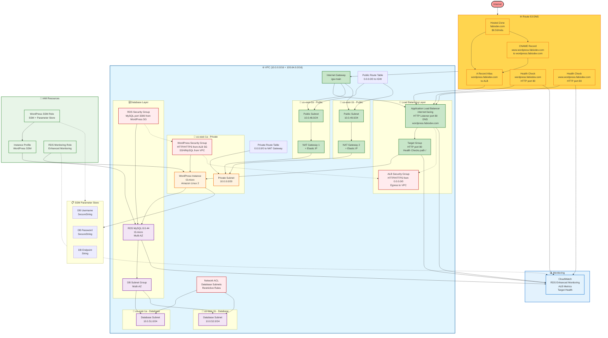

<!-- [MermaidChart: 7566cabe-9802-4593-bdce-b5543507b35b] -->
<!-- [MermaidChart: 7566cabe-9802-4593-bdce-b5543507b35b] -->
<!-- [MermaidChart: 7566cabe-9802-4593-bdce-b5543507b35b] -->
<!-- [MermaidChart: 14a48212-bea0-46ec-8723-509048192464] -->
<!-- [MermaidChart: 14a48212-bea0-46ec-8723-509048192464] -->
<!-- [MermaidChart: 14a48212-bea0-46ec-8723-509048192464] -->
# Diagrama da Arquitetura AWS - WordPress Infrastructure

Este diagrama representa todos os recursos AWS implementados no projeto Terraform WordPress, incluindo suas relações e dependências. **Agora com Route 53 DNS personalizado** para acesso profissional via `wordpress.fabiodev.com`.

## Diagrama Completo da Arquitetura



## Legenda dos Recursos

### 🌐 **Route 53 DNS (Issue #15)**

- **Hosted Zone**: `fabiodev.com` com configuração completa ($0.50/mês)
- **Registro A (Alias)**: `wordpress.fabiodev.com` → ALB
- **Registro CNAME**: `www.wordpress.fabiodev.com` → `wordpress.fabiodev.com`
- **Health Checks**: Monitoramento HTTP ativo ($0.50/mês cada)
- **Propagação Global**: DNS funcionando em servidores públicos
- **Name Servers**: 4 name servers AWS configurados

### 🌐 **Networking (VPC)**

- **VPC**: Rede virtual principal com CIDRs `10.0.0.0/16` + `100.64.0.0/16`
- **Internet Gateway**: Acesso à internet para subnets públicas
- **NAT Gateways**: 2 NAT Gateways para alta disponibilidade
- **Elastic IPs**: IPs públicos fixos para NAT Gateways

### 📍 **Subnets**

- **Public Subnets**: 2 subnets em AZs diferentes para ALB e NAT Gateways
- **Private Subnet**: 1 subnet para instâncias WordPress (isoladas)
- **Database Subnets**: 2 subnets isoladas para RDS Multi-AZ

### 🔄 **Load Balancing**

- **Application Load Balancer**: Internet-facing, distribuído em 2 AZs
- **DNS Personalizado**: Acessível via `wordpress.fabiodev.com`
- **Target Group**: HTTP port 80 com health checks
- **Listener**: HTTP (porta 80) com forward para WordPress
- **Múltiplos Acessos**: ALB direto + domínio personalizado

### 🖥️ **Compute**

- **EC2 Instance**: WordPress t3.micro na subnet privada
- **User Data**: Instalação automática WordPress + WP-CLI
- **EBS**: Volume GP3 20GB criptografado

### 🗄️ **Database**

- **RDS MySQL**: 8.0.44 t3.micro com Multi-AZ
- **Enhanced Monitoring**: Monitoramento detalhado habilitado
- **Backup**: Retenção 7 dias, janela configurada
- **Encryption**: Storage criptografado

### 🔐 **Security**

- **Security Groups**: ALB, WordPress e RDS com regras específicas
- **Network ACL**: Controle restritivo para subnets database
- **IAM Roles**: WordPress SSM e RDS monitoring

### 📋 **Configuration Management**

- **SSM Parameter Store**: Credenciais DB criptografadas
- **Instance Profile**: Acesso seguro aos parâmetros

### 📊 **Monitoring**

- **CloudWatch**: Métricas ALB, RDS e target health
- **Route 53 Health Checks**: Monitoramento DNS ativo
- **Enhanced Monitoring**: RDS performance insights
- **DNS Monitoring**: Status de propagação e resolução

## Fluxo de Tráfego

### **🎯 Fluxo Principal (Route 53)**

1. **Internet** → **Route 53 DNS** → **wordpress.fabiodev.com**
2. **DNS Resolution** → **ALB** (subnets públicas)
3. **ALB** → **Target Group** → **WordPress Instance** (subnet privada)
4. **WordPress** → **RDS MySQL** (subnets database isoladas)
5. **WordPress** → **NAT Gateway** → **Internet** (updates, APIs)

### **🔄 Fluxo Alternativo (ALB Direto)**

1. **Internet** → **Internet Gateway** → **ALB** (subnets públicas)
2. **ALB** → **Target Group** → **WordPress Instance** (subnet privada)

### **📊 Monitoramento**

1. **Route 53 Health Checks** → **ALB** → **CloudWatch**
2. **ALB Metrics** → **CloudWatch**
3. **RDS Enhanced Monitoring** → **CloudWatch**

## Issues Implementadas

- ✅ **Issue #1**: IAM Role SSM
- ✅ **Issue #3**: Security Groups  
- ✅ **Issue #4**: RDS MySQL
- ✅ **Issue #6**: Application Load Balancer
- ✅ **Issue #15**: Route 53 DNS Personalizado

## Próximas Expansões

- 🚀 **Issue #13**: HTTPS/SSL (ACM)
- 🚀 **Issue #16**: AWS WAF
- 🚀 **Issue #7**: Auto Scaling Group
- 🚀 **Issue #2**: EFS (Arquivos Compartilhados)
- 🚀 **Issue #5**: Launch Template

## 💰 Custos Mensais Atualizados

### **Recursos Ativos**

- **EC2 t3.micro**: ~$8.50/mês
- **RDS t3.micro**: ~$15/mês
- **ALB**: ~$16/mês
- **NAT Gateways**: ~$45/mês (2x)
- **Route 53 Hosted Zone**: $0.50/mês
- **Route 53 Health Checks**: $1/mês (2x)
- **EBS GP3 20GB**: ~$2/mês

### **Total Estimado**: ~$88/mês

### **Custos Anuais**

- **Domínio fabiodev.com**: $12/ano
- **Infraestrutura**: ~$1,056/ano
- **Total**: ~$1,068/ano

## 🌐 URLs de Acesso

### **Principal (Route 53)**

- ✅ `http://wordpress.fabiodev.com`
- ✅ `http://www.wordpress.fabiodev.com`

### **Backup (ALB Direto)**

- ✅ `http://cloudpro-vpc-alb-*.us-east-1.elb.amazonaws.com`

## 🧪 Validação

### **Comandos de Teste**

```bash
# Validação completa
make validate-all

# Validação Route 53 específica
make validate-route53
make validate-issue-15

# Testes DNS manuais
dig wordpress.fabiodev.com
curl -I http://wordpress.fabiodev.com
```

---

**Gerado automaticamente pelo projeto Terraform WordPress Infrastructure**
