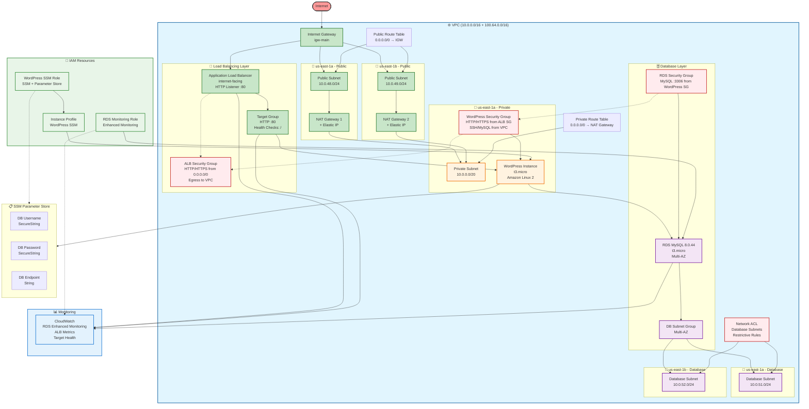

<!-- [MermaidChart: 7566cabe-9802-4593-bdce-b5543507b35b] -->
<!-- [MermaidChart: 7566cabe-9802-4593-bdce-b5543507b35b] -->
<!-- [MermaidChart: 7566cabe-9802-4593-bdce-b5543507b35b] -->
<!-- [MermaidChart: 14a48212-bea0-46ec-8723-509048192464] -->
<!-- [MermaidChart: 14a48212-bea0-46ec-8723-509048192464] -->
<!-- [MermaidChart: 14a48212-bea0-46ec-8723-509048192464] -->
# Diagrama da Arquitetura AWS - WordPress Infrastructure

Este diagrama representa todos os recursos AWS implementados no projeto Terraform WordPress, incluindo suas relações e dependências.

## Diagrama Completo da Arquitetura

## Legenda dos Recursos

### 🌐 **Networking (VPC)**

- **VPC**: Rede virtual principal com CIDRs `10.0.0.0/16` + `100.64.0.0/16`
- **Internet Gateway**: Acesso à internet para subnets públicas
- **NAT Gateways**: 2 NAT Gateways para alta disponibilidade
- **Elastic IPs**: IPs públicos fixos para NAT Gateways

### 📍 **Subnets**

- **Public Subnets**: 2 subnets em AZs diferentes para ALB e NAT Gateways
- **Private Subnet**: 1 subnet para instâncias WordPress (isoladas)
- **Database Subnets**: 2 subnets isoladas para RDS Multi-AZ

### 🔄 **Load Balancing**

- **Application Load Balancer**: Internet-facing, distribuído em 2 AZs
- **Target Group**: HTTP port 80 com health checks
- **Listener**: HTTP (porta 80) com forward para WordPress

### 🖥️ **Compute**

- **EC2 Instance**: WordPress t3.micro na subnet privada
- **User Data**: Instalação automática WordPress + WP-CLI
- **EBS**: Volume GP3 20GB criptografado

### 🗄️ **Database**

- **RDS MySQL**: 8.0.44 t3.micro com Multi-AZ
- **Enhanced Monitoring**: Monitoramento detalhado habilitado
- **Backup**: Retenção 7 dias, janela configurada
- **Encryption**: Storage criptografado

### 🔐 **Security**

- **Security Groups**: ALB, WordPress e RDS com regras específicas
- **Network ACL**: Controle restritivo para subnets database
- **IAM Roles**: WordPress SSM e RDS monitoring

### 📋 **Configuration Management**

- **SSM Parameter Store**: Credenciais DB criptografadas
- **Instance Profile**: Acesso seguro aos parâmetros

### 📊 **Monitoring**

- **CloudWatch**: Métricas ALB, RDS e target health
- **Enhanced Monitoring**: RDS performance insights

## Fluxo de Tráfego

1. **Internet** → **Internet Gateway** → **ALB** (subnets públicas)
2. **ALB** → **Target Group** → **WordPress Instance** (subnet privada)
3. **WordPress** → **RDS MySQL** (subnets database isoladas)
4. **WordPress** → **NAT Gateway** → **Internet** (updates, APIs)

## Issues Implementadas

- ✅ **Issue #1**: IAM Role SSM
- ✅ **Issue #3**: Security Groups  
- ✅ **Issue #4**: RDS MySQL
- ✅ **Issue #6**: Application Load Balancer

## Próximas Expansões

- 🚀 **Issue #13**: HTTPS/SSL (ACM)
- 🚀 **Issue #15**: Route 53 DNS
- 🚀 **Issue #16**: AWS WAF
- 🚀 **Issue #7**: Auto Scaling Group
- 🚀 **Issue #2**: EFS (Arquivos Compartilhados)

---

**Gerado automaticamente pelo projeto Terraform WordPress Infrastructure**
